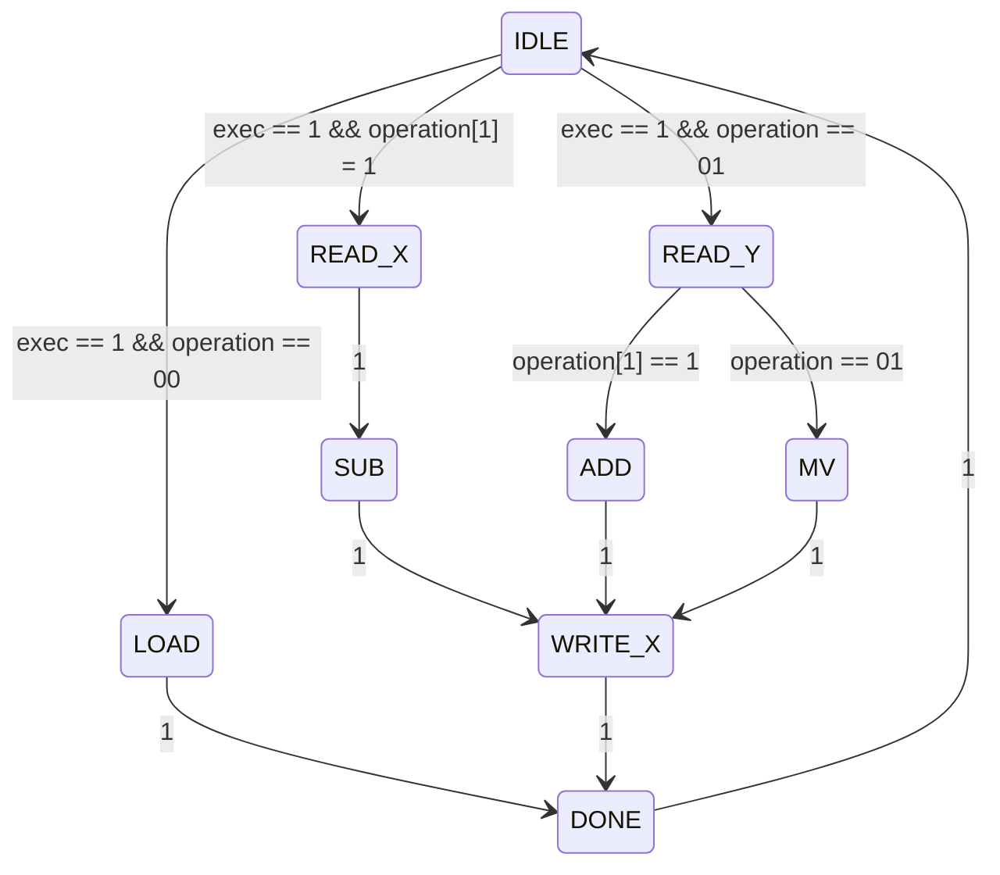

---
cssclasses:
- academic
- academic-two
---

$ pandoc -F mermaid-filter -o something.html ELEN122-Prelab2.md

Evan Stokdyk  
ELEN120 - PreLab 2  

In this lab, we aim to being the process of creating a simple ALU. The first
step is the data bate and control flow which requires the creation of a state
diagram. This is seen below:

Here is the output table for each state in the above diagram:

| State   | Rd_X | Rd_Y | Wr_X | A_in | G_in | Extern | G_out | add_sub |
|---------|------|------|------|------|------|--------|-------|---------|
| IDLE    | 0    | 0    | 0    | 0    | 0    | 0      | 0     | 0       |
| LOAD    | 0    | 0    | 1    | 0    | 0    | 1      | 0     | 0       |
| READ_Y  | 0    | 1    | 0    | 0    | 0    | 0      | 0     | 0       |
| READ_X  | 1    | 0    | 0    | 1    | 0    | 0      | 0     | 0       |
| ADD     | 0    | 0    | 0    | 0    | 0    | 0      | 0     | 0       |
| SUB     | 0    | 0    | 0    | 0    | 1    | 0      | 0     | 1       |
| MV      | 0    | 0    | 0    | 1    | 0    | 0      | 0     | 0       |
| WRITE_X | 0    | 0    | 1    | 0    | 0    | 0      | 1     | 0       |
| DONE    | 0    | 0    | 0    | 0    | 0    | 0      | 0     | 0       |

